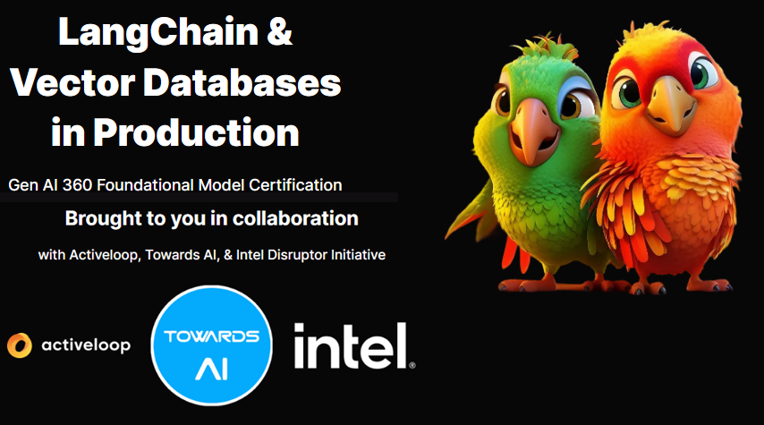

# LangChain and Vector Databases in Production Course

This is my repo for the work done for the course "Langchain and Vector Databases in Production". This repo contains code which follows the examples provided as well as my own explorations within the content of the course.

## Introduction to the course
Activeloop, Towards AI, and Intel Disruptor Initiative collaborate to bring Foundational Model Certification to tomorrow’s Gen AI professionals, executives and enthusiasts. The Foundational Model Certification is your essential gateway to mastering Large Language Models (LLMs) - from training to putting them in production. This cutting-edge three-course series designed to equip you with the knowledge and skills to train, fine-tune, and incorporate LLMs into AI products at your organization. In the first installment, jam-packed with 50+ lessons & 10+ practical projects, you will learn how to leverage LangChain, a robust framework for building applications with LLMs, and explore Deep Lake, a groundbreaking vector database for all AI data. 

## Why should you take this course?
1. Master LLM & Vector Database Fundamentals
  Dive into the LLM world, mastering its fundamentals & theory. Utilize our top-tier tips for seamless production use, integrating APIs, & advanced prompt engineering. Grasp vector databases the key to preventing LLM hallucination & boosting information retrieval.
2. Build Production-Grade LLM Applications with LangChain
  Move beyond the shiny demos you see on the social media & build applications that matter - from building automated sales & customer support agents to building recommendation engines. Utilize the full power of LangChain with chains and agents & Deep Lake.
3. Master the only Multi-Modal Vector Database
   Deep Lake is the vector database for all AI data - whether this is text, images, videos, multiple embeddings to the same data, etc. Learn how to use Deep Lake to build an ultimate data moat at your organization.

### Note:
<ul>
<li>Projects are not part of this repo. While basing my work on the projects provided, I have evolved my work even beyond the scope of the project. Hence, I have set these up as separate repos.</li>
<li>Not putting up the quiz results on the repo as well.</li>
</ul>
